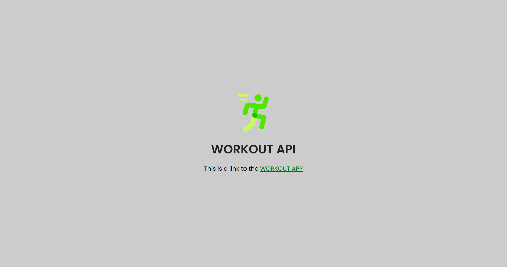

<br />
<div align="center">
  <a href="https://github.com/lyes-mersel/tuto-workouts-backend">
    
  </a>

  <h3 align="center">WORKOUT API</h3>
</div>


## About The Project
This is the REST_API I build to serve the [WORKOUT](https://tuto-workout.vercel.app) website.




### Built With

-  Node.js
-  Express
-  Mongo DB


### Installation

1. Clone the repo
   ```sh
   git clone https://github.com/lyes-mersel/tuto-workouts-backend.git
   ```
2. Install NPM packages
   ```sh
   npm install
   ```
3. Launch the server
    ```sh
    npm run dev
    ```


## Environment Variables

To run this project, you will need to add the following environment variables to your .env file

`PORT` => Port to use for the application

`MONGO_URI` => MongoDB Database URI

`SECRET` => The JWT signing secret


# Author
- Website - [Portfolio](https://lyes-mersel.netlify.app)
- Github - [@lyes-mersel](https://github.com/lyes-mersel)
- LinkedIn - [@lyes-mersel](https://www.linkedin.com/in/lyes-mersel/)
